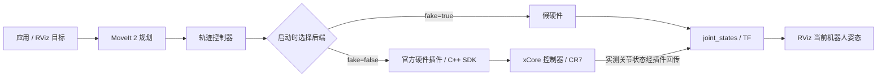

# 历史调研：CR7 建模与仿真

保留原始信息收集记录，资料日期见下文。ROS2 命令是未实施的搭建草案，不是当前跟随入口；当前使用方式见 [项目 README](../README.md)。

# xCore / xMate CR7 项目调研

调研日期：2026-09-21；实机进展更新：2026-10-04。ROS 仿真仍处于调研阶段；Python SDK 已连接实机并读取状态。快速使用见 [xcoresdk-python/README.md](../xcoresdk-python/README.md)，框架搭建见 [docs/DEVELOPMENT.md](../xcoresdk-python/docs/DEVELOPMENT.md)。

**建议采用 Ubuntu 22.04 + ROS 2 Humble + MoveIt 2 + 官方 `rokae_ros2`，先完成假硬件仿真，再接入 CR7。前置条件是确认这台旧款 CR7 的模型和控制器兼容性。** 如果目标只是离线工艺编程，也可以评估 RokaeStudio。现有 Python SDK 可用于应用开发及状态采集，但本身不是仿真器。

## 1. 实际使用的 CR7：以本地手册为基准

资料：[xMate CR7 硬件安装手册 V0.1](<../xMate CR7硬件安装手册-V0.1.pdf>)，文档标识 `202205190747/V0.1`。以下页码为手册印刷页码。

| 项目            | 本项目手册中的参数        | 位置        |
| ------------- | ---------------- | --------- |
| 自由度           | 6 轴；CR7 的“7”不是轴数 | 第 13、15 页 |
| 最大负载 / 最大臂展   | 7 kg / 850 mm    | 第 12、15 页 |
| 本体重量          | 约 27 kg          | 第 12、16 页 |
| 控制器形态         | 本体集成控制器          | 第 12 页    |
| 关节运动范围        | 六轴均为 ±175°       | 第 16 页    |
| 重复定位精度 / 防护等级 | ±0.02 mm / IP54  | 第 15–16 页 |

**不能直接把现售 CR7 的模型当作本机模型。** [官网现售 CR 系列](https://www.rokae.com/en/product/show/545/xMateCR.html)列出的 `CR7-7/0.98C` 为 988 mm 臂展、约 25 kg、IP67，与本地手册明显不同。官方 ROS 2 虽提供 CR7 配置，但仅凭名称不足以证明适配本机。

接入前应通过铭牌、序列号、RobotAssist 中的型号和控制器版本，向珞石确认对应的 URDF、mesh、关节零位、轴方向、限位、惯量及法兰坐标。若官方模型面向另一代 CR7，应获取旧型号模型或独立适配，不能只缩放 mesh，也不能把 850 mm 与 988 mm 的差异作为 TCP 偏移处理。

## 2. 指定网站和版本核查

已实际访问用户指定的 [珞石技术文档网站](http://sw.rokae.com:8989/)及其 [ROS2 使用说明](http://sw.rokae.com:8989/docs/ROS2/rokae_ros2_manual)。首次受当前执行环境 DNS 限制，切换网络访问方式后读取成功。

该站点是技术文档站，包含 SDK、控制系统、插件、ROS2 和下载入口。部分网页元信息中的地址为 `localhost:4000`，不应把它当作用户需要部署的服务地址；继续使用实际网站域名访问章节即可。

| 资料 / 软件                     | 本次看到的版本要求                                    | 如何使用                              |
| --------------------------- | -------------------------------------------- | --------------------------------- |
| 指定网站 ROS2 手册                | V0.0.2，发布日期 2026-04-10；Ubuntu 22.04 / Humble | 理解架构和参数；接口以所选源码为准                 |
| 官方 `rokae_ros2` 主分支 README  | 栈 0.0.4；C++ SDK 0.7.1；xCore 控制器 ≥ 3.2.1      | 作为当前官方栈的兼容性基线                     |
| 本地 `xcoresdk-python`（已更新 SDK 0.7.1） | README 要求控制器 ≥ 3.2.1；实机正是 3.2.1 | Python 原生 SDK 与 CLI 已读取实机，ROS2 仍需单独验证 |

来源：[官方 ROS2 仓库](https://github.com/RokaeRobot/rokae_ros2)、[本地 Python SDK README](../xcoresdk-python/docs/README.md)。主分支会变化，正式搭建时必须记录 commit、SDK 包版本和控制器版本，固定经过验证的组合。

## 3. 仿真方案分别能做什么

| 路线                           | 用途                         | 与实机的关系 / 限制                                                                             |
| ---------------------------- | -------------------------- | --------------------------------------------------------------------------------------- |
| ROS2 + MoveIt 2 + RViz + 假硬件 | 验证模型、运动规划、碰撞场景和轨迹执行接口      | 官方参数 `use_fake_hardware:=true` 使用 `mock_components/GenericSystem`；不连接实机，不验证电机、接触力或真实动力学 |
| ROS2 + 官方真实硬件插件              | 将规划轨迹发给实机，同时用实际关节状态更新 RViz | `use_fake_hardware:=false`；需匹配 SDK、控制器、模型及现场网络                                          |
| Gazebo                       | 需要重力、接触等物理场景时进一步评估         | 当前仓库有 `rokae_gazebo`，但本次未确认本机旧款 CR7 的完整启动流程、物理参数及验证结果                                   |
| RokaeStudio                  | 工位布局、轨迹生成、干涉检查、离线程序生成      | 官方介绍支持导出控制系统运动程序；旧款 CR7 模型和软件授权需确认                                                      |
| RobotAssist                  | 参数配置、状态监控、示教与控制器操作         | 用于实机配置和诊断；不能据其界面有 3D 模型便认定存在完整离线控制器仿真                                                   |

ROS2 参数与模型支持见[指定站点使用说明](http://sw.rokae.com:8989/docs/ROS2/rokae_ros2_manual)；Gazebo 包存在性见[官方仓库](https://github.com/RokaeRobot/rokae_ros2)。RokaeStudio 的离线编程与程序导出能力见[官方介绍](https://www.rokae.com/cn/news/show/880/RokaeStudio)；RobotAssist 的定位见[官方文档概述](https://docs.rokae.com/docs/)。

本项目建议先做假硬件规划验证。只有明确需要接触、力控等物理仿真时，再单独验证 Gazebo 模型和控制插件。本次未找到足够证据确认“可直接运行本机 xCore 控制程序、并让 SDK 像连接真机一样连接”的独立虚拟控制器方案，需向厂家核实；不能把假硬件、IO 仿真或插件开发虚拟机等同于该能力。

## 4. ROS2 仿真环境搭建草案

下面是后续实施步骤，尚未在本工作区执行。命令使用当前目录下的 `ros2_ws`。

### 4.1 环境与依赖

使用 Ubuntu 22.04 x86_64、ROS2 Humble；建议 16 GB 内存、至少 20 GB 可用磁盘。先按 [ROS2 Humble 官方安装文档](https://docs.ros.org/en/humble/Installation/Ubuntu-Install-Debs.html)完成基础安装，再安装 MoveIt 2、ros2_control、colcon、rosdep 等依赖。硬件建议和常用包见[珞石使用说明](http://sw.rokae.com:8989/docs/ROS2/rokae_ros2_manual)。

```bash
cd /home/knight/projects/xcore
mkdir -p ros2_ws/src
git clone https://github.com/RokaeRobot/rokae_ros2.git ros2_ws/src/rokae_ros2
git -C ros2_ws/src/rokae_ros2 rev-parse HEAD
cat ros2_ws/src/rokae_ros2/rokae_hardware/sdk/VERSION
```

记录 commit 后，先补齐 C++ SDK 库再编译：官方仓库不包含 SDK 预编译库。按 `sdk/VERSION` 去 [xCoreSDK-CPP Releases](https://github.com/RokaeRobot/xCoreSDK-CPP/releases)选择匹配版本和架构的包，按照[库安装说明](https://github.com/RokaeRobot/rokae_ros2/blob/main/rokae_hardware/sdk/lib/README.md)，把包内 `lib/Linux/<arch>/` 的 `libxCoreSDK.a`、`libxMateModel.a` 放入 `rokae_hardware/sdk/lib/`。当前说明以 0.7.1 为例。

本地 Python `.so` / `.pyd` 不是这些 C++ 静态库的替代品。即使先使用假硬件，完整构建官方栈仍应满足其链接依赖。

```bash
source /opt/ros/humble/setup.bash
cd /home/knight/projects/xcore/ros2_ws
# 前提：rosdep 已初始化；新系统按 rosdep 文档完成一次初始化。
rosdep update
rosdep install --from-paths src/rokae_ros2 --ignore-src -r -y
colcon build --symlink-install
source install/setup.bash
```

构建流程参考[仓库 README](https://github.com/RokaeRobot/rokae_ros2)。若出现 SDK 链接错误，先核对版本、CPU 架构和静态库位置。

### 4.2 启动假硬件仿真

```bash
source /opt/ros/humble/setup.bash
source /home/knight/projects/xcore/ros2_ws/install/setup.bash
ros2 launch rokae_hardware rokae_moveit_launch.py \
  robot_type:=CR7 \
  use_fake_hardware:=true
```

**务必显式传入 `true`。** 本次读取的[官方启动源码](https://github.com/RokaeRobot/rokae_ros2/blob/main/rokae_hardware/launch/rokae_moveit_launch.py)中，该参数默认值为 `false`。在尚未核实旧款模型前，此命令只用于验证软件流程，不能据此宣布完成本机仿真适配。

在 RViz 的 MotionPlanning 中设置目标，先 Plan 检查轨迹，再在假硬件模式下 Execute。将台面、夹具、工具等加入规划场景后再测试绕障。此阶段验证的是规划与接口，真实碰撞检测仍取决于模型、场景及标定准确性。

建议验收：六轴模型方向、零位和尺寸正确；控制器正常激活；关节状态随虚拟执行更新；目标可达与不可达时有合理结果；加入障碍物后规划能避障或正确失败。可使用以下只读诊断命令：

```bash
ros2 control list_controllers
ros2 topic echo /joint_states --once
ros2 action list
```

## 5. 如何与实机联动

### 5.1 两条数据链路



这意味着同一上层规划流程可切换执行后端；实机模式下 RViz 可显示机器人反馈状态。它不是“让 Gazebo 与实机自动双向同步”，也不是把假硬件位置当作实机反馈。架构依据：[ROS2 手册](http://sw.rokae.com:8989/docs/ROS2/rokae_ros2_manual)及[官方硬件接口源码](https://github.com/RokaeRobot/rokae_ros2/blob/main/rokae_hardware/src/rokae_hardware_interface.cpp)。

### 5.2 接入前检查与网络配置

1. 确认旧款 CR7 是否支持所选 ROS2 栈要求的控制器版本；若不支持，向厂家获取匹配的历史版本或适配方案，不直接升级控制器。
2. 核实 SDK / RCI 授权、控制器配置和 RobotAssist 版本。通用 SDK 文档不代表所有历史机型的 RCI 设置相同。
3. PC 通过有线以太网接入机器人控制器，配置同网段且不冲突的地址。`robot_ip` 是控制器地址，`local_ip` 是 PC 上连接机器人的网卡地址，不是回环地址或任意其他网卡地址。
4. 在 RobotAssist 核对机器人零位、安装方向、工具 TCP、负载、坐标系和关节限位。ROS 模型也须一致；以弧度、米为基础核对接口单位和六轴顺序。
5. 先完成只读状态采集、网络稳定性和断线处理验证，再做低速小范围运动。规划模型中的障碍物不能替代实机安全功能。

以太网与实时连接建议、授权说明见[SDK 快速开始](https://docs.rokae.com/docs/SDK/quick_start/)和[官方 C++ SDK 仓库](https://github.com/RokaeRobot/xCoreSDK-CPP)。本次检查的硬件插件申请 1 ms 状态流，因此不能只用 `ping` 成功判定实时链路合格；实际周期和丢包情况需现场测量。

### 5.3 实机启动模板

**下列启动会进入实机控制流程，不是只读监视。** 本次检查的硬件接口源码在连接过程中包含切换自动模式及 `setPowerState(true)`；必须在模型、网络、安全回路及操作条件确认后启动。[源码依据](https://github.com/RokaeRobot/rokae_ros2/blob/main/rokae_hardware/src/rokae_hardware_interface.cpp)

```bash
# 示例地址，必须替换为现场配置；先停止假硬件实例。
ros2 launch rokae_hardware rokae_moveit_launch.py \
  robot_type:=CR7 \
  use_fake_hardware:=false \
  robot_ip:=192.168.2.160 \
  local_ip:=192.168.2.1
```

启动参数与切换方式参考[官方 Demo 说明](https://github.com/RokaeRobot/rokae_ros2/blob/main/doc/README_demo.md)。避免同时运行多个会向同一机器人写入运动命令的程序。

项目建议的验收顺序：先核对 RViz 当前姿态与实机读数一致，再从实机当前状态规划单次小幅运动，核对执行结果和状态回传，最后验证停止、取消、断线及错误处理。模型或坐标有偏差时先修正，不能用扩大容差掩盖问题。

### 5.4 如果只需要“实机动，屏幕模型跟着动”

可以单独实现 SDK 状态采集，将实测关节角映射为 ROS `sensor_msgs/JointState`，交给 `robot_state_publisher` 和 RViz。该方案不需要把 MoveIt 轨迹下发链路一起启动，是本项目可优先实现的联动里程碑。

这是基于现有接口提出的实现方案，尚未编码验证。需核对关节名称、顺序、方向、时间戳和更新频率，并确保只有预期的数据源发布该机器人的状态。

## 6. 当前 Python SDK 可以如何使用

当前本地使用 SDK 0.7.1、CPython 3.11.16，Linux 扩展为 `cpython-311-x86_64-linux-gnu.so`。已完成原生 SDK 连接及状态、关节、法兰位姿、软限位和 DH 参数读取，并搭建 `uv run xcore [指令] [参数]` 框架。解释器必须匹配扩展 ABI；SDK 可以支持多个 Python 版本，但同一 `cpython-310` 扩展不能直接用于 3.11。

六轴 CR7 使用 `xMateRobot`；本机返回 `XMC7-R850-W4X3B4`、6 轴、控制器 3.2.1。实际 IP 为 **`192.168.2.160`**。快速启动和验证边界见 [SDK 使用说明](../xcoresdk-python/README.md)，原生 SDK 最小查询、架构和完整命令见 [开发文档](../xcoresdk-python/docs/DEVELOPMENT.md)。

厂商部分示例会自动上电或运动，首次建议运行 `uv run xcore doctor` 和 `uv run xcore status`。查询不发送上电或运动准备指令，但 SDK 断连会停止已有运动，应在机器人空闲、无其他 SDK 控制会话时使用。原生 SDK 已完成第六轴小幅运动与返回测试；CLI `move-joint` 和 `movej` 随后已实测成功；最新默认速度参数为 1000，J6 当前配置下实测峰值约 40°/s。

## 7. RokaeStudio 备选路线

官方介绍确认其具备模型导入、工位仿真、轨迹生成、碰撞检查及运动程序导出功能。实施顺序可为：获取安装包和账号 → 选择准确的旧款 CR7 模型 → 配置工具与工件 → 离线规划和检查 → 导出与控制器版本匹配的程序 → 实机标定并验证。[官方介绍及下载指引](https://www.rokae.com/cn/news/show/880/RokaeStudio)

该介绍发表于 2021 年，不能据此确认当前安装包、OS 支持和授权政策。本次也未验证其是否支持旧款 CR7 在线状态同步、SDK 接入虚拟控制器或一键部署程序；这些能力应取得具体版本手册后再决定。

## 8. 下一阶段需要补齐的信息

| 待确认项                            | 影响                           |
| ------------------------------- | ---------------------------- |
| 铭牌完整型号、序列号、850 mm 版本确认          | 决定采用哪个 URDF / mesh / 动力学模型   |
| 实机 xCore 版本、SDK / RCI 授权和升级支持   | 决定能否使用当前 ROS2 0.0.4，或需厂家历史版本 |
| 匹配本机的 ROS2 软件包、C++ SDK 与模型版本    | 固定可复现的依赖组合                   |
| 网口连接方式、IP、实时链路要求及 RCI 配置        | 决定实机通信和控制方案                  |
| 仿真目标：规划避障、状态镜像，还是接触 / 力控        | 决定假硬件是否足够，是否另建物理仿真           |
| RokaeStudio 旧款模型、安装包、授权、虚拟控制器能力 | 判断是否采用厂商离线编程路线               |

当前结论：**官方已提供 CR7 名称下的 ROS2 仿真 / 实机联动路径；本项目能否直接复用，仍取决于 850 mm 旧款型号的模型和控制器兼容性。** 下一阶段应先完成版本和型号核对，再搭建假硬件环境，随后做只读实机镜像，最后验证运动控制。


## 9. 2026-10-04：实机 SDK 已连通

用户重新克隆 SDK，并安装与 Python 3.11 匹配的 v0.7.1 扩展后，已先使用原生 SDK，再验证 CLI 状态查询。机械臂返回 `XMC7-R850-W4X3B4`、6 轴、控制器 3.2.1；这确认了具体型号及 R850 标识，匹配旧款 CR7 手册的 850 mm 系列。ROS2 模型兼容性仍需单独核对。

实际机械臂 IP 是 **`192.168.2.160`**，原先提供的 `192.168.0.160` 没有完成连接。电脑原 DHCP 地址 `192.255.2.100/24` 不与机器人同网段；为有线网卡 `enx00e04c634750` 增加并保存 `192.168.2.100/24` 后，SDK 已通过该网卡直接连接。原 DHCP 配置保留，临时探测地址已清理，未修改机器人或路由器配置。

已读取型号、控制器版本、电源／操作／运行状态、关节角、法兰位姿、软限位及校准／标称 DH 参数。首次查询时为下电、手动、空闲；随后原生 SDK 已完成上电、自动模式、第六轴约 +1° 运动与返回，并恢复下电／手动／空闲。SDK 关节数组有 12 项、DH 有 28 项；框架按六轴解析前 6 个角度和前 24 个 DH 值，额外槽位单独保留。

框架支持 `doctor`、`network`、`status`、`info`、`joints`、`pose`、`limits`、`dh`、`monitor`、`power`、`mode`、`stop`、`movej`、`move-joint`、`check`。原生 SDK 非实时运动已验证；首次使用 0.05° 全轴容差超时，随后以框架默认 0.2° 容差成功返回保存的原始位置，最大六轴误差约 0.080°。CLI `move-joint` 与 `movej` 随后已在速度实验中验证，默认速度最终设为 1000；实验数据见搭建文档。见 [快速启动](../xcoresdk-python/README.md)和 [搭建文档](../xcoresdk-python/docs/DEVELOPMENT.md)。
